# Clustering Algorithms Comparison on IBM HR Data

#### Compared Algorithms:
    * K-Means Clustering
    * Agglomerative Clustering
    * DBSCAN Clustering
    * Mean-Shift Clustering
    * BIRCH Clustering
    * Affinity Propagation
    * Mini-batch k-means
    * Spectral Clustering
    
## Objective
   _Clustering aims to maximize intra-cluster similarity and minimize inter-cluster similarity._

    Each clustering problems requires own unique solutions. According to my observation, most of tutorials and guidebooks focus on K-means clustering and the data preparation process before. I want to introduce other clustering algorithms and  to inform when do we need other algorithms. 
    
## Data
   Due to more practical explanation, I am going to use
   [IBM HR Analytics Employee Attrition & Performance Dataset](https://www.kaggle.com/pavansubhasht/ibm-hr-analytics-attrition-dataset)

## Review of the Data


```python
!pip install -U scikit-learn
```

    Requirement already up-to-date: scikit-learn in c:\users\arda\anaconda3\lib\site-packages (0.24.0)
    Requirement already satisfied, skipping upgrade: joblib>=0.11 in c:\users\arda\anaconda3\lib\site-packages (from scikit-learn) (0.13.2)
    Requirement already satisfied, skipping upgrade: threadpoolctl>=2.0.0 in c:\users\arda\anaconda3\lib\site-packages (from scikit-learn) (2.1.0)
    Requirement already satisfied, skipping upgrade: numpy>=1.13.3 in c:\users\arda\anaconda3\lib\site-packages (from scikit-learn) (1.16.4)
    Requirement already satisfied, skipping upgrade: scipy>=0.19.1 in c:\users\arda\anaconda3\lib\site-packages (from scikit-learn) (1.2.1)
    


```python
import sklearn
from sklearn import metrics

import pandas as pd
import numpy as np
import matplotlib
import matplotlib.pyplot as plt
import seaborn as sns
from tqdm import tqdm
from collections import Counter

import warnings
warnings.filterwarnings("ignore")

plt.style.use("seaborn-whitegrid")
```


```python
data = pd.read_csv(r'C:\Users\Arda\Downloads\WA_Fn-UseC_-HR-Employee-Attrition.csv')

data.head()
```


<div>
<style scoped>
    .dataframe tbody tr th:only-of-type {
        vertical-align: middle;
    }

    .dataframe tbody tr th {
        vertical-align: top;
    }

    .dataframe thead th {
        text-align: right;
    }
</style>
<table border="1" class="dataframe">
  <thead>
    <tr style="text-align: right;">
      <th></th>
      <th>Age</th>
      <th>Attrition</th>
      <th>BusinessTravel</th>
      <th>DailyRate</th>
      <th>Department</th>
      <th>DistanceFromHome</th>
      <th>Education</th>
      <th>EducationField</th>
      <th>EmployeeCount</th>
      <th>EmployeeNumber</th>
      <th>...</th>
      <th>RelationshipSatisfaction</th>
      <th>StandardHours</th>
      <th>StockOptionLevel</th>
      <th>TotalWorkingYears</th>
      <th>TrainingTimesLastYear</th>
      <th>WorkLifeBalance</th>
      <th>YearsAtCompany</th>
      <th>YearsInCurrentRole</th>
      <th>YearsSinceLastPromotion</th>
      <th>YearsWithCurrManager</th>
    </tr>
  </thead>
  <tbody>
    <tr>
      <th>0</th>
      <td>41</td>
      <td>Yes</td>
      <td>Travel_Rarely</td>
      <td>1102</td>
      <td>Sales</td>
      <td>1</td>
      <td>2</td>
      <td>Life Sciences</td>
      <td>1</td>
      <td>1</td>
      <td>...</td>
      <td>1</td>
      <td>80</td>
      <td>0</td>
      <td>8</td>
      <td>0</td>
      <td>1</td>
      <td>6</td>
      <td>4</td>
      <td>0</td>
      <td>5</td>
    </tr>
    <tr>
      <th>1</th>
      <td>49</td>
      <td>No</td>
      <td>Travel_Frequently</td>
      <td>279</td>
      <td>Research &amp; Development</td>
      <td>8</td>
      <td>1</td>
      <td>Life Sciences</td>
      <td>1</td>
      <td>2</td>
      <td>...</td>
      <td>4</td>
      <td>80</td>
      <td>1</td>
      <td>10</td>
      <td>3</td>
      <td>3</td>
      <td>10</td>
      <td>7</td>
      <td>1</td>
      <td>7</td>
    </tr>
    <tr>
      <th>2</th>
      <td>37</td>
      <td>Yes</td>
      <td>Travel_Rarely</td>
      <td>1373</td>
      <td>Research &amp; Development</td>
      <td>2</td>
      <td>2</td>
      <td>Other</td>
      <td>1</td>
      <td>4</td>
      <td>...</td>
      <td>2</td>
      <td>80</td>
      <td>0</td>
      <td>7</td>
      <td>3</td>
      <td>3</td>
      <td>0</td>
      <td>0</td>
      <td>0</td>
      <td>0</td>
    </tr>
    <tr>
      <th>3</th>
      <td>33</td>
      <td>No</td>
      <td>Travel_Frequently</td>
      <td>1392</td>
      <td>Research &amp; Development</td>
      <td>3</td>
      <td>4</td>
      <td>Life Sciences</td>
      <td>1</td>
      <td>5</td>
      <td>...</td>
      <td>3</td>
      <td>80</td>
      <td>0</td>
      <td>8</td>
      <td>3</td>
      <td>3</td>
      <td>8</td>
      <td>7</td>
      <td>3</td>
      <td>0</td>
    </tr>
    <tr>
      <th>4</th>
      <td>27</td>
      <td>No</td>
      <td>Travel_Rarely</td>
      <td>591</td>
      <td>Research &amp; Development</td>
      <td>2</td>
      <td>1</td>
      <td>Medical</td>
      <td>1</td>
      <td>7</td>
      <td>...</td>
      <td>4</td>
      <td>80</td>
      <td>1</td>
      <td>6</td>
      <td>3</td>
      <td>3</td>
      <td>2</td>
      <td>2</td>
      <td>2</td>
      <td>2</td>
    </tr>
  </tbody>
</table>
<p>5 rows × 35 columns</p>
</div>


```python
data.dtypes
```


    Age                          int64
    Attrition                   object
    BusinessTravel              object
    DailyRate                    int64
    Department                  object
    DistanceFromHome             int64
    Education                    int64
    EducationField              object
    EmployeeCount                int64
    EmployeeNumber               int64
    EnvironmentSatisfaction      int64
    Gender                      object
    HourlyRate                   int64
    JobInvolvement               int64
    JobLevel                     int64
    JobRole                     object
    JobSatisfaction              int64
    MaritalStatus               object
    MonthlyIncome                int64
    MonthlyRate                  int64
    NumCompaniesWorked           int64
    Over18                      object
    OverTime                    object
    PercentSalaryHike            int64
    PerformanceRating            int64
    RelationshipSatisfaction     int64
    StandardHours                int64
    StockOptionLevel             int64
    TotalWorkingYears            int64
    TrainingTimesLastYear        int64
    WorkLifeBalance              int64
    YearsAtCompany               int64
    YearsInCurrentRole           int64
    YearsSinceLastPromotion      int64
    YearsWithCurrManager         int64
    dtype: object


### Missing Value Check


```python
data.isnull().sum()
```


    Age                         0
    Attrition                   0
    BusinessTravel              0
    DailyRate                   0
    Department                  0
    DistanceFromHome            0
    Education                   0
    EducationField              0
    EmployeeCount               0
    EmployeeNumber              0
    EnvironmentSatisfaction     0
    Gender                      0
    HourlyRate                  0
    JobInvolvement              0
    JobLevel                    0
    JobRole                     0
    JobSatisfaction             0
    MaritalStatus               0
    MonthlyIncome               0
    MonthlyRate                 0
    NumCompaniesWorked          0
    Over18                      0
    OverTime                    0
    PercentSalaryHike           0
    PerformanceRating           0
    RelationshipSatisfaction    0
    StandardHours               0
    StockOptionLevel            0
    TotalWorkingYears           0
    TrainingTimesLastYear       0
    WorkLifeBalance             0
    YearsAtCompany              0
    YearsInCurrentRole          0
    YearsSinceLastPromotion     0
    YearsWithCurrManager        0
    dtype: int64


### Descriptive Statistics of Data


```python
data.describe()


```


<div>
<style scoped>
    .dataframe tbody tr th:only-of-type {
        vertical-align: middle;
    }

    .dataframe tbody tr th {
        vertical-align: top;
    }

    .dataframe thead th {
        text-align: right;
    }
</style>
<table border="1" class="dataframe">
  <thead>
    <tr style="text-align: right;">
      <th></th>
      <th>Age</th>
      <th>DailyRate</th>
      <th>DistanceFromHome</th>
      <th>Education</th>
      <th>EmployeeCount</th>
      <th>EmployeeNumber</th>
      <th>EnvironmentSatisfaction</th>
      <th>HourlyRate</th>
      <th>JobInvolvement</th>
      <th>JobLevel</th>
      <th>...</th>
      <th>YearsSinceLastPromotion</th>
      <th>YearsWithCurrManager</th>
      <th>BusinessTravel_Encoded</th>
      <th>Department_Encoded</th>
      <th>EducationField_Encoded</th>
      <th>Gender_Encoded</th>
      <th>JobRole_Encoded</th>
      <th>MaritalStatus_Encoded</th>
      <th>OverTime_Encoded</th>
      <th>Attrition_Binary</th>
    </tr>
  </thead>
  <tbody>
    <tr>
      <th>count</th>
      <td>1394.000000</td>
      <td>1394.000000</td>
      <td>1394.000000</td>
      <td>1394.000000</td>
      <td>1394.0</td>
      <td>1394.000000</td>
      <td>1394.000000</td>
      <td>1394.000000</td>
      <td>1394.000000</td>
      <td>1394.000000</td>
      <td>...</td>
      <td>1394.000000</td>
      <td>1394.000000</td>
      <td>1394.000000</td>
      <td>1394.000000</td>
      <td>1394.000000</td>
      <td>1394.000000</td>
      <td>1394.000000</td>
      <td>1394.000000</td>
      <td>1394.000000</td>
      <td>1394.000000</td>
    </tr>
    <tr>
      <th>mean</th>
      <td>36.337159</td>
      <td>803.802726</td>
      <td>9.241750</td>
      <td>2.900287</td>
      <td>1.0</td>
      <td>1026.103300</td>
      <td>2.720230</td>
      <td>65.973458</td>
      <td>2.730273</td>
      <td>1.947633</td>
      <td>...</td>
      <td>1.831420</td>
      <td>3.879484</td>
      <td>1.606887</td>
      <td>1.263989</td>
      <td>2.247489</td>
      <td>0.599713</td>
      <td>4.505022</td>
      <td>1.106887</td>
      <td>0.286944</td>
      <td>0.167145</td>
    </tr>
    <tr>
      <th>std</th>
      <td>8.895079</td>
      <td>402.718076</td>
      <td>8.067533</td>
      <td>1.018543</td>
      <td>0.0</td>
      <td>603.468113</td>
      <td>1.092587</td>
      <td>20.309310</td>
      <td>0.710188</td>
      <td>0.993582</td>
      <td>...</td>
      <td>2.650412</td>
      <td>3.366546</td>
      <td>0.665299</td>
      <td>0.526983</td>
      <td>1.333649</td>
      <td>0.490132</td>
      <td>2.485343</td>
      <td>0.731348</td>
      <td>0.452498</td>
      <td>0.373239</td>
    </tr>
    <tr>
      <th>min</th>
      <td>18.000000</td>
      <td>102.000000</td>
      <td>1.000000</td>
      <td>1.000000</td>
      <td>1.0</td>
      <td>1.000000</td>
      <td>1.000000</td>
      <td>30.000000</td>
      <td>1.000000</td>
      <td>1.000000</td>
      <td>...</td>
      <td>0.000000</td>
      <td>0.000000</td>
      <td>0.000000</td>
      <td>0.000000</td>
      <td>0.000000</td>
      <td>0.000000</td>
      <td>0.000000</td>
      <td>0.000000</td>
      <td>0.000000</td>
      <td>0.000000</td>
    </tr>
    <tr>
      <th>25%</th>
      <td>30.000000</td>
      <td>467.250000</td>
      <td>2.000000</td>
      <td>2.000000</td>
      <td>1.0</td>
      <td>492.250000</td>
      <td>2.000000</td>
      <td>48.000000</td>
      <td>2.000000</td>
      <td>1.000000</td>
      <td>...</td>
      <td>0.000000</td>
      <td>2.000000</td>
      <td>1.000000</td>
      <td>1.000000</td>
      <td>1.000000</td>
      <td>0.000000</td>
      <td>2.000000</td>
      <td>1.000000</td>
      <td>0.000000</td>
      <td>0.000000</td>
    </tr>
    <tr>
      <th>50%</th>
      <td>35.000000</td>
      <td>804.500000</td>
      <td>7.000000</td>
      <td>3.000000</td>
      <td>1.0</td>
      <td>1017.500000</td>
      <td>3.000000</td>
      <td>66.000000</td>
      <td>3.000000</td>
      <td>2.000000</td>
      <td>...</td>
      <td>1.000000</td>
      <td>3.000000</td>
      <td>2.000000</td>
      <td>1.000000</td>
      <td>2.000000</td>
      <td>1.000000</td>
      <td>5.000000</td>
      <td>1.000000</td>
      <td>0.000000</td>
      <td>0.000000</td>
    </tr>
    <tr>
      <th>75%</th>
      <td>42.000000</td>
      <td>1157.000000</td>
      <td>14.000000</td>
      <td>4.000000</td>
      <td>1.0</td>
      <td>1559.500000</td>
      <td>4.000000</td>
      <td>84.000000</td>
      <td>3.000000</td>
      <td>2.000000</td>
      <td>...</td>
      <td>2.000000</td>
      <td>7.000000</td>
      <td>2.000000</td>
      <td>2.000000</td>
      <td>3.000000</td>
      <td>1.000000</td>
      <td>7.000000</td>
      <td>2.000000</td>
      <td>1.000000</td>
      <td>0.000000</td>
    </tr>
    <tr>
      <th>max</th>
      <td>60.000000</td>
      <td>1499.000000</td>
      <td>29.000000</td>
      <td>5.000000</td>
      <td>1.0</td>
      <td>2068.000000</td>
      <td>4.000000</td>
      <td>100.000000</td>
      <td>4.000000</td>
      <td>5.000000</td>
      <td>...</td>
      <td>15.000000</td>
      <td>17.000000</td>
      <td>2.000000</td>
      <td>2.000000</td>
      <td>5.000000</td>
      <td>1.000000</td>
      <td>8.000000</td>
      <td>2.000000</td>
      <td>1.000000</td>
      <td>1.000000</td>
    </tr>
  </tbody>
</table>
<p>8 rows × 34 columns</p>
</div>


### Univariate Variable Analysis: Numerical Data


```python
sns.set(style='white',font_scale=1.3, rc={'figure.figsize':(20,20)})
ax=data.hist(bins=20,color='blue')
```


### Univariate Variable Analysis: Categorical Data


```python
def bar_plot(variable):
    
    var = data[variable]
    varValue = var.value_counts()
    
    plt.figure(figsize=(9,3))
    plt.bar(varValue.index,varValue)
    plt.xticks(varValue.index, varValue.index.values, rotation='vertical')
    plt.ylabel('Frequency')
    plt.title(variable)
    plt.show()
    print("{}: \n {}".format(variable,varValue))
```

#### Attrition


```python
category_attrition = ['Attrition']

for c in category_attrition:
    bar_plot(c)
```


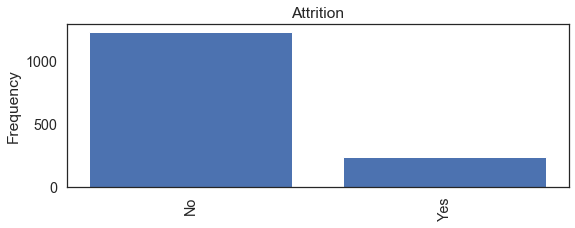


    Attrition: 
     No     1233
    Yes     237
    Name: Attrition, dtype: int64
    

#### Business Travel


```python
from sklearn.preprocessing import OrdinalEncoder

ord_enc = OrdinalEncoder()
data['BusinessTravel_Encoded'] = ord_enc.fit_transform(data[['BusinessTravel']])

### TRAVEL RARELY = 2
### TRAVEL FREQUENTLY = 1
### NON-TRAVEL = 0

category_businesstravel = ['BusinessTravel']

for c in category_businesstravel:
    bar_plot(c)
```


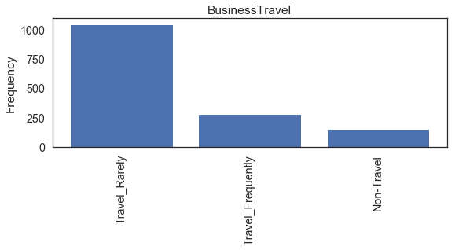


    BusinessTravel: 
     Travel_Rarely        1043
    Travel_Frequently     277
    Non-Travel            150
    Name: BusinessTravel, dtype: int64
    

#### Department


```python
data['Department_Encoded'] = ord_enc.fit_transform(data[['Department']])

category_department = ['Department']

### SALES = 2
### RESEARCH = 1
### HR = 0

for c in category_department:
    bar_plot(c)
```


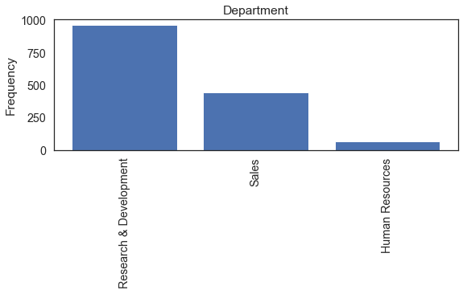


    Department: 
     Research & Development    961
    Sales                     446
    Human Resources            63
    Name: Department, dtype: int64
    

#### Education Field


```python

data['EducationField_Encoded'] = ord_enc.fit_transform(data[['EducationField']])

### TECHNICAL DEGREE = 5
### OTHER = 4
### MEDICAL = 3
### MARKETING = 2
### LIFE SCIENCES = 1
### HR = 0

category_education = ['EducationField']

for c in category_education:
    bar_plot(c)
```


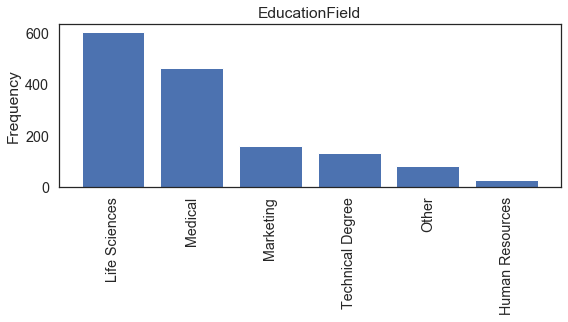


    EducationField: 
     Life Sciences       606
    Medical             464
    Marketing           159
    Technical Degree    132
    Other                82
    Human Resources      27
    Name: EducationField, dtype: int64
    

#### Gender


```python
data['Gender_Encoded'] = ord_enc.fit_transform(data[['Gender']])

### MALE = 1
### FEMALE = 0

category_gender = ['Gender']

for c in category_gender:
    bar_plot(c)
```


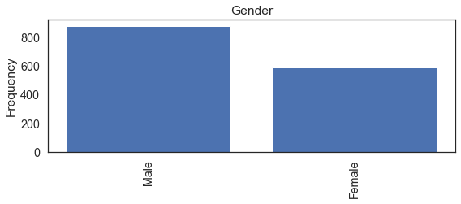


    Gender: 
     Male      882
    Female    588
    Name: Gender, dtype: int64
    

#### Job Role


```python
data['JobRole_Encoded'] = ord_enc.fit_transform(data[['JobRole']])

### SALES REPRESENTATIVE = 8
### SALES EXECUTIVE = 7
### RESEARCH SCIENTIST = 6
### RESEARCH DIRECTOR = 5
### MANUFACTORING DIRECTOR = 4
### MANAGER = 3
### LABRATORY TECHNICAN = 2
### HR = 1
### HEALTHCARE REPRESANTATIVE = 0

category_jobrole = ['JobRole']

for c in category_jobrole:
    bar_plot(c)
```


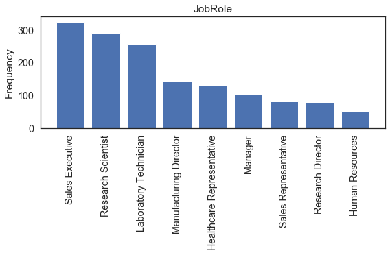


    JobRole: 
     Sales Executive              326
    Research Scientist           292
    Laboratory Technician        259
    Manufacturing Director       145
    Healthcare Representative    131
    Manager                      102
    Sales Representative          83
    Research Director             80
    Human Resources               52
    Name: JobRole, dtype: int64
    

#### Marital Status


```python
data['MaritalStatus_Encoded'] = ord_enc.fit_transform(data[['MaritalStatus']])


### SINGLE = 2
### MARRIED = 1
### DIVORCED = 0

category_maritalstatus = ['MaritalStatus']

for c in category_maritalstatus:
    bar_plot(c)
```


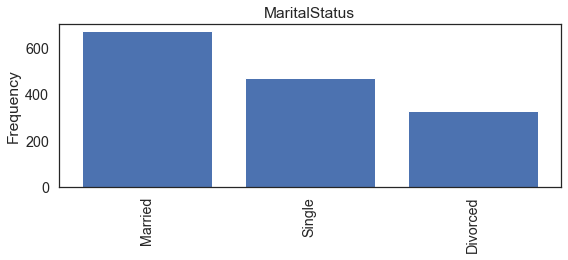


    MaritalStatus: 
     Married     673
    Single      470
    Divorced    327
    Name: MaritalStatus, dtype: int64
    

#### Over Time


```python
data['OverTime_Encoded'] = ord_enc.fit_transform(data[['OverTime']])

### YES = 1
### NO = 0

category_overtime = ['OverTime']

for c in category_overtime:
    bar_plot(c)
```


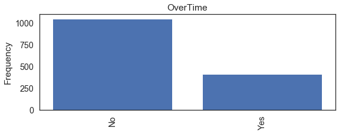


    OverTime: 
     No     1054
    Yes     416
    Name: OverTime, dtype: int64
    


```python

```

### Basic Data Analysis: Categorical Data
    * Over Time - Attrition
    * Job Role - Attrition
    * Marital Status - Attrition


```python
data['Attrition_Binary'] = ord_enc.fit_transform(data[['Attrition']])

#data[['Attrition_Binary','Attrition']].head(10)
# 1 = YES
# 0 = NO

data[['OverTime','Attrition_Binary']].groupby(['OverTime'], as_index = False).mean().sort_values(by='Attrition_Binary',ascending=False)

```


<div>
<style scoped>
    .dataframe tbody tr th:only-of-type {
        vertical-align: middle;
    }

    .dataframe tbody tr th {
        vertical-align: top;
    }

    .dataframe thead th {
        text-align: right;
    }
</style>
<table border="1" class="dataframe">
  <thead>
    <tr style="text-align: right;">
      <th></th>
      <th>OverTime</th>
      <th>Attrition_Binary</th>
    </tr>
  </thead>
  <tbody>
    <tr>
      <th>1</th>
      <td>Yes</td>
      <td>0.305288</td>
    </tr>
    <tr>
      <th>0</th>
      <td>No</td>
      <td>0.104364</td>
    </tr>
  </tbody>
</table>
</div>


```python
data[['JobRole','Attrition_Binary']].groupby(['JobRole'], as_index = False).mean().sort_values(by='Attrition_Binary',ascending=False)

```


<div>
<style scoped>
    .dataframe tbody tr th:only-of-type {
        vertical-align: middle;
    }

    .dataframe tbody tr th {
        vertical-align: top;
    }

    .dataframe thead th {
        text-align: right;
    }
</style>
<table border="1" class="dataframe">
  <thead>
    <tr style="text-align: right;">
      <th></th>
      <th>JobRole</th>
      <th>Attrition_Binary</th>
    </tr>
  </thead>
  <tbody>
    <tr>
      <th>8</th>
      <td>Sales Representative</td>
      <td>0.397590</td>
    </tr>
    <tr>
      <th>2</th>
      <td>Laboratory Technician</td>
      <td>0.239382</td>
    </tr>
    <tr>
      <th>1</th>
      <td>Human Resources</td>
      <td>0.230769</td>
    </tr>
    <tr>
      <th>7</th>
      <td>Sales Executive</td>
      <td>0.174847</td>
    </tr>
    <tr>
      <th>6</th>
      <td>Research Scientist</td>
      <td>0.160959</td>
    </tr>
    <tr>
      <th>4</th>
      <td>Manufacturing Director</td>
      <td>0.068966</td>
    </tr>
    <tr>
      <th>0</th>
      <td>Healthcare Representative</td>
      <td>0.068702</td>
    </tr>
    <tr>
      <th>3</th>
      <td>Manager</td>
      <td>0.049020</td>
    </tr>
    <tr>
      <th>5</th>
      <td>Research Director</td>
      <td>0.025000</td>
    </tr>
  </tbody>
</table>
</div>


```python
data[['MaritalStatus','Attrition_Binary']].groupby(['MaritalStatus'], as_index = False).mean().sort_values(by='Attrition_Binary',ascending=False)
```


<div>
<style scoped>
    .dataframe tbody tr th:only-of-type {
        vertical-align: middle;
    }

    .dataframe tbody tr th {
        vertical-align: top;
    }

    .dataframe thead th {
        text-align: right;
    }
</style>
<table border="1" class="dataframe">
  <thead>
    <tr style="text-align: right;">
      <th></th>
      <th>MaritalStatus</th>
      <th>Attrition_Binary</th>
    </tr>
  </thead>
  <tbody>
    <tr>
      <th>2</th>
      <td>Single</td>
      <td>0.255319</td>
    </tr>
    <tr>
      <th>1</th>
      <td>Married</td>
      <td>0.124814</td>
    </tr>
    <tr>
      <th>0</th>
      <td>Divorced</td>
      <td>0.100917</td>
    </tr>
  </tbody>
</table>
</div>


### Outlier Detection


```python
def detect_outliers(df,features):
    
    outlier_indices = []
    
    for c in features:
        Q1 = np.percentile(df[c],25)
        
        Q3 = np.percentile(df[c],75)
        
        IQR = Q3 - Q1
        
        outlier_step = IQR * 1.5
        
        outlier_list_col = df[(df[c] < Q1 - outlier_step) | (df[c] > Q3 + outlier_step)].index
        
        outlier_indices.extend(outlier_list_col)
        
    outlier_indices = Counter(outlier_indices)
    multiple_outliers = list(i for i, v in outlier_indices.items() if v > 2)
    
    return multiple_outliers
```


```python
data.loc[detect_outliers(data,['Age','DailyRate','DistanceFromHome','EmployeeNumber','MonthlyIncome','MonthlyRate','NumCompaniesWorked','PercentSalaryHike','PerformanceRating','StockOptionLevel','TotalWorkingYears','TrainingTimesLastYear','YearsAtCompany','YearsInCurrentRole','YearsSinceLastPromotion','YearsWithCurrManager'])]

```


<div>
<style scoped>
    .dataframe tbody tr th:only-of-type {
        vertical-align: middle;
    }

    .dataframe tbody tr th {
        vertical-align: top;
    }

    .dataframe thead th {
        text-align: right;
    }
</style>
<table border="1" class="dataframe">
  <thead>
    <tr style="text-align: right;">
      <th></th>
      <th>Age</th>
      <th>Attrition</th>
      <th>BusinessTravel</th>
      <th>DailyRate</th>
      <th>Department</th>
      <th>DistanceFromHome</th>
      <th>Education</th>
      <th>EducationField</th>
      <th>EmployeeCount</th>
      <th>EmployeeNumber</th>
      <th>...</th>
      <th>YearsSinceLastPromotion</th>
      <th>YearsWithCurrManager</th>
      <th>BusinessTravel_Encoded</th>
      <th>Department_Encoded</th>
      <th>EducationField_Encoded</th>
      <th>Gender_Encoded</th>
      <th>JobRole_Encoded</th>
      <th>MaritalStatus_Encoded</th>
      <th>OverTime_Encoded</th>
      <th>Attrition_Binary</th>
    </tr>
  </thead>
  <tbody>
    <tr>
      <th>45</th>
      <td>41</td>
      <td>Yes</td>
      <td>Travel_Rarely</td>
      <td>1360</td>
      <td>Research &amp; Development</td>
      <td>12</td>
      <td>3</td>
      <td>Technical Degree</td>
      <td>1</td>
      <td>58</td>
      <td>...</td>
      <td>15</td>
      <td>8</td>
      <td>2.0</td>
      <td>1.0</td>
      <td>5.0</td>
      <td>0.0</td>
      <td>5.0</td>
      <td>1.0</td>
      <td>0.0</td>
      <td>1.0</td>
    </tr>
    <tr>
      <th>62</th>
      <td>50</td>
      <td>No</td>
      <td>Travel_Rarely</td>
      <td>989</td>
      <td>Research &amp; Development</td>
      <td>7</td>
      <td>2</td>
      <td>Medical</td>
      <td>1</td>
      <td>80</td>
      <td>...</td>
      <td>13</td>
      <td>8</td>
      <td>2.0</td>
      <td>1.0</td>
      <td>3.0</td>
      <td>0.0</td>
      <td>5.0</td>
      <td>0.0</td>
      <td>1.0</td>
      <td>0.0</td>
    </tr>
    <tr>
      <th>105</th>
      <td>59</td>
      <td>No</td>
      <td>Non-Travel</td>
      <td>1420</td>
      <td>Human Resources</td>
      <td>2</td>
      <td>4</td>
      <td>Human Resources</td>
      <td>1</td>
      <td>140</td>
      <td>...</td>
      <td>2</td>
      <td>2</td>
      <td>0.0</td>
      <td>0.0</td>
      <td>0.0</td>
      <td>0.0</td>
      <td>3.0</td>
      <td>1.0</td>
      <td>0.0</td>
      <td>0.0</td>
    </tr>
    <tr>
      <th>123</th>
      <td>51</td>
      <td>No</td>
      <td>Travel_Rarely</td>
      <td>684</td>
      <td>Research &amp; Development</td>
      <td>6</td>
      <td>3</td>
      <td>Life Sciences</td>
      <td>1</td>
      <td>162</td>
      <td>...</td>
      <td>15</td>
      <td>15</td>
      <td>2.0</td>
      <td>1.0</td>
      <td>1.0</td>
      <td>1.0</td>
      <td>5.0</td>
      <td>2.0</td>
      <td>0.0</td>
      <td>0.0</td>
    </tr>
    <tr>
      <th>186</th>
      <td>40</td>
      <td>No</td>
      <td>Travel_Rarely</td>
      <td>989</td>
      <td>Research &amp; Development</td>
      <td>4</td>
      <td>1</td>
      <td>Medical</td>
      <td>1</td>
      <td>253</td>
      <td>...</td>
      <td>9</td>
      <td>9</td>
      <td>2.0</td>
      <td>1.0</td>
      <td>3.0</td>
      <td>0.0</td>
      <td>3.0</td>
      <td>1.0</td>
      <td>0.0</td>
      <td>0.0</td>
    </tr>
    <tr>
      <th>187</th>
      <td>55</td>
      <td>No</td>
      <td>Travel_Rarely</td>
      <td>692</td>
      <td>Research &amp; Development</td>
      <td>14</td>
      <td>4</td>
      <td>Medical</td>
      <td>1</td>
      <td>254</td>
      <td>...</td>
      <td>2</td>
      <td>15</td>
      <td>2.0</td>
      <td>1.0</td>
      <td>3.0</td>
      <td>1.0</td>
      <td>5.0</td>
      <td>2.0</td>
      <td>0.0</td>
      <td>0.0</td>
    </tr>
    <tr>
      <th>190</th>
      <td>52</td>
      <td>No</td>
      <td>Travel_Rarely</td>
      <td>699</td>
      <td>Research &amp; Development</td>
      <td>1</td>
      <td>4</td>
      <td>Life Sciences</td>
      <td>1</td>
      <td>259</td>
      <td>...</td>
      <td>11</td>
      <td>9</td>
      <td>2.0</td>
      <td>1.0</td>
      <td>1.0</td>
      <td>1.0</td>
      <td>3.0</td>
      <td>1.0</td>
      <td>0.0</td>
      <td>0.0</td>
    </tr>
    <tr>
      <th>194</th>
      <td>45</td>
      <td>No</td>
      <td>Non-Travel</td>
      <td>1195</td>
      <td>Research &amp; Development</td>
      <td>2</td>
      <td>2</td>
      <td>Medical</td>
      <td>1</td>
      <td>264</td>
      <td>...</td>
      <td>11</td>
      <td>8</td>
      <td>0.0</td>
      <td>1.0</td>
      <td>3.0</td>
      <td>1.0</td>
      <td>3.0</td>
      <td>1.0</td>
      <td>0.0</td>
      <td>0.0</td>
    </tr>
    <tr>
      <th>231</th>
      <td>42</td>
      <td>No</td>
      <td>Travel_Rarely</td>
      <td>532</td>
      <td>Research &amp; Development</td>
      <td>4</td>
      <td>2</td>
      <td>Technical Degree</td>
      <td>1</td>
      <td>319</td>
      <td>...</td>
      <td>11</td>
      <td>15</td>
      <td>2.0</td>
      <td>1.0</td>
      <td>5.0</td>
      <td>1.0</td>
      <td>3.0</td>
      <td>1.0</td>
      <td>0.0</td>
      <td>0.0</td>
    </tr>
    <tr>
      <th>237</th>
      <td>52</td>
      <td>No</td>
      <td>Non-Travel</td>
      <td>771</td>
      <td>Sales</td>
      <td>2</td>
      <td>4</td>
      <td>Life Sciences</td>
      <td>1</td>
      <td>329</td>
      <td>...</td>
      <td>15</td>
      <td>12</td>
      <td>0.0</td>
      <td>2.0</td>
      <td>1.0</td>
      <td>1.0</td>
      <td>3.0</td>
      <td>2.0</td>
      <td>1.0</td>
      <td>0.0</td>
    </tr>
    <tr>
      <th>257</th>
      <td>40</td>
      <td>No</td>
      <td>Travel_Rarely</td>
      <td>1416</td>
      <td>Research &amp; Development</td>
      <td>2</td>
      <td>2</td>
      <td>Medical</td>
      <td>1</td>
      <td>352</td>
      <td>...</td>
      <td>3</td>
      <td>9</td>
      <td>2.0</td>
      <td>1.0</td>
      <td>3.0</td>
      <td>1.0</td>
      <td>5.0</td>
      <td>0.0</td>
      <td>0.0</td>
      <td>0.0</td>
    </tr>
    <tr>
      <th>270</th>
      <td>55</td>
      <td>No</td>
      <td>Travel_Rarely</td>
      <td>452</td>
      <td>Research &amp; Development</td>
      <td>1</td>
      <td>3</td>
      <td>Medical</td>
      <td>1</td>
      <td>374</td>
      <td>...</td>
      <td>4</td>
      <td>13</td>
      <td>2.0</td>
      <td>1.0</td>
      <td>3.0</td>
      <td>1.0</td>
      <td>3.0</td>
      <td>2.0</td>
      <td>1.0</td>
      <td>0.0</td>
    </tr>
    <tr>
      <th>280</th>
      <td>53</td>
      <td>No</td>
      <td>Travel_Rarely</td>
      <td>1070</td>
      <td>Research &amp; Development</td>
      <td>3</td>
      <td>4</td>
      <td>Medical</td>
      <td>1</td>
      <td>386</td>
      <td>...</td>
      <td>1</td>
      <td>3</td>
      <td>2.0</td>
      <td>1.0</td>
      <td>3.0</td>
      <td>1.0</td>
      <td>5.0</td>
      <td>1.0</td>
      <td>1.0</td>
      <td>0.0</td>
    </tr>
    <tr>
      <th>314</th>
      <td>39</td>
      <td>No</td>
      <td>Travel_Rarely</td>
      <td>117</td>
      <td>Research &amp; Development</td>
      <td>10</td>
      <td>1</td>
      <td>Medical</td>
      <td>1</td>
      <td>429</td>
      <td>...</td>
      <td>11</td>
      <td>10</td>
      <td>2.0</td>
      <td>1.0</td>
      <td>3.0</td>
      <td>1.0</td>
      <td>3.0</td>
      <td>1.0</td>
      <td>1.0</td>
      <td>0.0</td>
    </tr>
    <tr>
      <th>326</th>
      <td>39</td>
      <td>No</td>
      <td>Travel_Frequently</td>
      <td>672</td>
      <td>Research &amp; Development</td>
      <td>7</td>
      <td>2</td>
      <td>Medical</td>
      <td>1</td>
      <td>444</td>
      <td>...</td>
      <td>13</td>
      <td>3</td>
      <td>1.0</td>
      <td>1.0</td>
      <td>3.0</td>
      <td>1.0</td>
      <td>3.0</td>
      <td>1.0</td>
      <td>0.0</td>
      <td>0.0</td>
    </tr>
    <tr>
      <th>411</th>
      <td>60</td>
      <td>No</td>
      <td>Travel_Rarely</td>
      <td>422</td>
      <td>Research &amp; Development</td>
      <td>7</td>
      <td>3</td>
      <td>Life Sciences</td>
      <td>1</td>
      <td>549</td>
      <td>...</td>
      <td>11</td>
      <td>10</td>
      <td>2.0</td>
      <td>1.0</td>
      <td>1.0</td>
      <td>0.0</td>
      <td>3.0</td>
      <td>1.0</td>
      <td>0.0</td>
      <td>0.0</td>
    </tr>
    <tr>
      <th>417</th>
      <td>40</td>
      <td>No</td>
      <td>Travel_Rarely</td>
      <td>1398</td>
      <td>Sales</td>
      <td>2</td>
      <td>4</td>
      <td>Life Sciences</td>
      <td>1</td>
      <td>558</td>
      <td>...</td>
      <td>1</td>
      <td>12</td>
      <td>2.0</td>
      <td>2.0</td>
      <td>1.0</td>
      <td>0.0</td>
      <td>3.0</td>
      <td>1.0</td>
      <td>0.0</td>
      <td>0.0</td>
    </tr>
    <tr>
      <th>425</th>
      <td>50</td>
      <td>No</td>
      <td>Travel_Rarely</td>
      <td>1099</td>
      <td>Research &amp; Development</td>
      <td>29</td>
      <td>4</td>
      <td>Life Sciences</td>
      <td>1</td>
      <td>569</td>
      <td>...</td>
      <td>15</td>
      <td>7</td>
      <td>2.0</td>
      <td>1.0</td>
      <td>1.0</td>
      <td>1.0</td>
      <td>3.0</td>
      <td>1.0</td>
      <td>0.0</td>
      <td>0.0</td>
    </tr>
    <tr>
      <th>445</th>
      <td>55</td>
      <td>No</td>
      <td>Travel_Rarely</td>
      <td>1117</td>
      <td>Sales</td>
      <td>18</td>
      <td>5</td>
      <td>Life Sciences</td>
      <td>1</td>
      <td>597</td>
      <td>...</td>
      <td>7</td>
      <td>7</td>
      <td>2.0</td>
      <td>2.0</td>
      <td>1.0</td>
      <td>0.0</td>
      <td>3.0</td>
      <td>2.0</td>
      <td>0.0</td>
      <td>0.0</td>
    </tr>
    <tr>
      <th>466</th>
      <td>41</td>
      <td>No</td>
      <td>Travel_Rarely</td>
      <td>1276</td>
      <td>Sales</td>
      <td>2</td>
      <td>5</td>
      <td>Life Sciences</td>
      <td>1</td>
      <td>625</td>
      <td>...</td>
      <td>11</td>
      <td>8</td>
      <td>2.0</td>
      <td>2.0</td>
      <td>1.0</td>
      <td>0.0</td>
      <td>3.0</td>
      <td>1.0</td>
      <td>0.0</td>
      <td>0.0</td>
    </tr>
    <tr>
      <th>473</th>
      <td>49</td>
      <td>No</td>
      <td>Travel_Rarely</td>
      <td>1245</td>
      <td>Research &amp; Development</td>
      <td>18</td>
      <td>4</td>
      <td>Life Sciences</td>
      <td>1</td>
      <td>638</td>
      <td>...</td>
      <td>0</td>
      <td>9</td>
      <td>2.0</td>
      <td>1.0</td>
      <td>1.0</td>
      <td>1.0</td>
      <td>5.0</td>
      <td>0.0</td>
      <td>1.0</td>
      <td>0.0</td>
    </tr>
    <tr>
      <th>477</th>
      <td>50</td>
      <td>No</td>
      <td>Travel_Frequently</td>
      <td>1246</td>
      <td>Human Resources</td>
      <td>3</td>
      <td>3</td>
      <td>Medical</td>
      <td>1</td>
      <td>644</td>
      <td>...</td>
      <td>10</td>
      <td>7</td>
      <td>1.0</td>
      <td>0.0</td>
      <td>3.0</td>
      <td>1.0</td>
      <td>3.0</td>
      <td>1.0</td>
      <td>0.0</td>
      <td>0.0</td>
    </tr>
    <tr>
      <th>535</th>
      <td>41</td>
      <td>No</td>
      <td>Travel_Rarely</td>
      <td>427</td>
      <td>Human Resources</td>
      <td>10</td>
      <td>4</td>
      <td>Human Resources</td>
      <td>1</td>
      <td>731</td>
      <td>...</td>
      <td>12</td>
      <td>6</td>
      <td>2.0</td>
      <td>0.0</td>
      <td>0.0</td>
      <td>1.0</td>
      <td>3.0</td>
      <td>0.0</td>
      <td>0.0</td>
      <td>0.0</td>
    </tr>
    <tr>
      <th>561</th>
      <td>52</td>
      <td>No</td>
      <td>Travel_Rarely</td>
      <td>621</td>
      <td>Sales</td>
      <td>3</td>
      <td>4</td>
      <td>Marketing</td>
      <td>1</td>
      <td>776</td>
      <td>...</td>
      <td>1</td>
      <td>16</td>
      <td>2.0</td>
      <td>2.0</td>
      <td>2.0</td>
      <td>1.0</td>
      <td>3.0</td>
      <td>1.0</td>
      <td>0.0</td>
      <td>0.0</td>
    </tr>
    <tr>
      <th>584</th>
      <td>42</td>
      <td>No</td>
      <td>Travel_Frequently</td>
      <td>570</td>
      <td>Research &amp; Development</td>
      <td>8</td>
      <td>3</td>
      <td>Life Sciences</td>
      <td>1</td>
      <td>809</td>
      <td>...</td>
      <td>14</td>
      <td>9</td>
      <td>1.0</td>
      <td>1.0</td>
      <td>1.0</td>
      <td>1.0</td>
      <td>3.0</td>
      <td>0.0</td>
      <td>0.0</td>
      <td>0.0</td>
    </tr>
    <tr>
      <th>595</th>
      <td>58</td>
      <td>Yes</td>
      <td>Travel_Rarely</td>
      <td>286</td>
      <td>Research &amp; Development</td>
      <td>2</td>
      <td>4</td>
      <td>Life Sciences</td>
      <td>1</td>
      <td>825</td>
      <td>...</td>
      <td>13</td>
      <td>8</td>
      <td>2.0</td>
      <td>1.0</td>
      <td>1.0</td>
      <td>1.0</td>
      <td>5.0</td>
      <td>2.0</td>
      <td>1.0</td>
      <td>1.0</td>
    </tr>
    <tr>
      <th>653</th>
      <td>50</td>
      <td>No</td>
      <td>Non-Travel</td>
      <td>881</td>
      <td>Research &amp; Development</td>
      <td>2</td>
      <td>4</td>
      <td>Life Sciences</td>
      <td>1</td>
      <td>905</td>
      <td>...</td>
      <td>14</td>
      <td>7</td>
      <td>0.0</td>
      <td>1.0</td>
      <td>1.0</td>
      <td>1.0</td>
      <td>3.0</td>
      <td>0.0</td>
      <td>0.0</td>
      <td>0.0</td>
    </tr>
    <tr>
      <th>714</th>
      <td>50</td>
      <td>No</td>
      <td>Travel_Rarely</td>
      <td>1126</td>
      <td>Research &amp; Development</td>
      <td>1</td>
      <td>2</td>
      <td>Medical</td>
      <td>1</td>
      <td>997</td>
      <td>...</td>
      <td>1</td>
      <td>3</td>
      <td>2.0</td>
      <td>1.0</td>
      <td>3.0</td>
      <td>1.0</td>
      <td>5.0</td>
      <td>0.0</td>
      <td>0.0</td>
      <td>0.0</td>
    </tr>
    <tr>
      <th>746</th>
      <td>41</td>
      <td>No</td>
      <td>Non-Travel</td>
      <td>247</td>
      <td>Research &amp; Development</td>
      <td>7</td>
      <td>1</td>
      <td>Life Sciences</td>
      <td>1</td>
      <td>1035</td>
      <td>...</td>
      <td>5</td>
      <td>10</td>
      <td>0.0</td>
      <td>1.0</td>
      <td>1.0</td>
      <td>0.0</td>
      <td>5.0</td>
      <td>0.0</td>
      <td>0.0</td>
      <td>0.0</td>
    </tr>
    <tr>
      <th>749</th>
      <td>52</td>
      <td>Yes</td>
      <td>Travel_Rarely</td>
      <td>266</td>
      <td>Sales</td>
      <td>2</td>
      <td>1</td>
      <td>Marketing</td>
      <td>1</td>
      <td>1038</td>
      <td>...</td>
      <td>6</td>
      <td>9</td>
      <td>2.0</td>
      <td>2.0</td>
      <td>2.0</td>
      <td>0.0</td>
      <td>3.0</td>
      <td>1.0</td>
      <td>0.0</td>
      <td>1.0</td>
    </tr>
    <tr>
      <th>...</th>
      <td>...</td>
      <td>...</td>
      <td>...</td>
      <td>...</td>
      <td>...</td>
      <td>...</td>
      <td>...</td>
      <td>...</td>
      <td>...</td>
      <td>...</td>
      <td>...</td>
      <td>...</td>
      <td>...</td>
      <td>...</td>
      <td>...</td>
      <td>...</td>
      <td>...</td>
      <td>...</td>
      <td>...</td>
      <td>...</td>
      <td>...</td>
    </tr>
    <tr>
      <th>1184</th>
      <td>54</td>
      <td>No</td>
      <td>Travel_Rarely</td>
      <td>584</td>
      <td>Research &amp; Development</td>
      <td>22</td>
      <td>5</td>
      <td>Medical</td>
      <td>1</td>
      <td>1665</td>
      <td>...</td>
      <td>4</td>
      <td>7</td>
      <td>2.0</td>
      <td>1.0</td>
      <td>3.0</td>
      <td>0.0</td>
      <td>3.0</td>
      <td>1.0</td>
      <td>0.0</td>
      <td>0.0</td>
    </tr>
    <tr>
      <th>1225</th>
      <td>45</td>
      <td>No</td>
      <td>Travel_Rarely</td>
      <td>1005</td>
      <td>Research &amp; Development</td>
      <td>28</td>
      <td>2</td>
      <td>Technical Degree</td>
      <td>1</td>
      <td>1719</td>
      <td>...</td>
      <td>8</td>
      <td>6</td>
      <td>2.0</td>
      <td>1.0</td>
      <td>5.0</td>
      <td>0.0</td>
      <td>5.0</td>
      <td>2.0</td>
      <td>0.0</td>
      <td>0.0</td>
    </tr>
    <tr>
      <th>1242</th>
      <td>40</td>
      <td>No</td>
      <td>Travel_Rarely</td>
      <td>611</td>
      <td>Sales</td>
      <td>7</td>
      <td>4</td>
      <td>Medical</td>
      <td>1</td>
      <td>1740</td>
      <td>...</td>
      <td>12</td>
      <td>8</td>
      <td>2.0</td>
      <td>2.0</td>
      <td>3.0</td>
      <td>1.0</td>
      <td>3.0</td>
      <td>2.0</td>
      <td>0.0</td>
      <td>0.0</td>
    </tr>
    <tr>
      <th>1264</th>
      <td>55</td>
      <td>No</td>
      <td>Travel_Rarely</td>
      <td>478</td>
      <td>Research &amp; Development</td>
      <td>2</td>
      <td>3</td>
      <td>Medical</td>
      <td>1</td>
      <td>1770</td>
      <td>...</td>
      <td>0</td>
      <td>0</td>
      <td>2.0</td>
      <td>1.0</td>
      <td>3.0</td>
      <td>1.0</td>
      <td>5.0</td>
      <td>1.0</td>
      <td>0.0</td>
      <td>0.0</td>
    </tr>
    <tr>
      <th>1331</th>
      <td>48</td>
      <td>No</td>
      <td>Travel_Rarely</td>
      <td>1224</td>
      <td>Research &amp; Development</td>
      <td>10</td>
      <td>3</td>
      <td>Life Sciences</td>
      <td>1</td>
      <td>1867</td>
      <td>...</td>
      <td>12</td>
      <td>9</td>
      <td>2.0</td>
      <td>1.0</td>
      <td>1.0</td>
      <td>1.0</td>
      <td>5.0</td>
      <td>1.0</td>
      <td>0.0</td>
      <td>0.0</td>
    </tr>
    <tr>
      <th>1348</th>
      <td>40</td>
      <td>No</td>
      <td>Travel_Rarely</td>
      <td>1137</td>
      <td>Research &amp; Development</td>
      <td>1</td>
      <td>4</td>
      <td>Life Sciences</td>
      <td>1</td>
      <td>1892</td>
      <td>...</td>
      <td>11</td>
      <td>16</td>
      <td>2.0</td>
      <td>1.0</td>
      <td>1.0</td>
      <td>1.0</td>
      <td>3.0</td>
      <td>0.0</td>
      <td>0.0</td>
      <td>0.0</td>
    </tr>
    <tr>
      <th>1351</th>
      <td>48</td>
      <td>No</td>
      <td>Travel_Frequently</td>
      <td>117</td>
      <td>Research &amp; Development</td>
      <td>22</td>
      <td>3</td>
      <td>Medical</td>
      <td>1</td>
      <td>1900</td>
      <td>...</td>
      <td>4</td>
      <td>7</td>
      <td>1.0</td>
      <td>1.0</td>
      <td>3.0</td>
      <td>0.0</td>
      <td>3.0</td>
      <td>0.0</td>
      <td>0.0</td>
      <td>0.0</td>
    </tr>
    <tr>
      <th>1401</th>
      <td>55</td>
      <td>No</td>
      <td>Travel_Rarely</td>
      <td>189</td>
      <td>Human Resources</td>
      <td>26</td>
      <td>4</td>
      <td>Human Resources</td>
      <td>1</td>
      <td>1973</td>
      <td>...</td>
      <td>1</td>
      <td>4</td>
      <td>2.0</td>
      <td>0.0</td>
      <td>0.0</td>
      <td>1.0</td>
      <td>3.0</td>
      <td>1.0</td>
      <td>1.0</td>
      <td>0.0</td>
    </tr>
    <tr>
      <th>401</th>
      <td>56</td>
      <td>No</td>
      <td>Travel_Frequently</td>
      <td>906</td>
      <td>Sales</td>
      <td>6</td>
      <td>3</td>
      <td>Life Sciences</td>
      <td>1</td>
      <td>532</td>
      <td>...</td>
      <td>7</td>
      <td>7</td>
      <td>1.0</td>
      <td>2.0</td>
      <td>1.0</td>
      <td>0.0</td>
      <td>7.0</td>
      <td>1.0</td>
      <td>0.0</td>
      <td>0.0</td>
    </tr>
    <tr>
      <th>544</th>
      <td>47</td>
      <td>No</td>
      <td>Travel_Frequently</td>
      <td>217</td>
      <td>Sales</td>
      <td>3</td>
      <td>3</td>
      <td>Medical</td>
      <td>1</td>
      <td>746</td>
      <td>...</td>
      <td>11</td>
      <td>13</td>
      <td>1.0</td>
      <td>2.0</td>
      <td>3.0</td>
      <td>0.0</td>
      <td>7.0</td>
      <td>0.0</td>
      <td>1.0</td>
      <td>0.0</td>
    </tr>
    <tr>
      <th>90</th>
      <td>40</td>
      <td>No</td>
      <td>Travel_Frequently</td>
      <td>530</td>
      <td>Research &amp; Development</td>
      <td>1</td>
      <td>4</td>
      <td>Life Sciences</td>
      <td>1</td>
      <td>119</td>
      <td>...</td>
      <td>11</td>
      <td>11</td>
      <td>1.0</td>
      <td>1.0</td>
      <td>1.0</td>
      <td>1.0</td>
      <td>0.0</td>
      <td>1.0</td>
      <td>0.0</td>
      <td>0.0</td>
    </tr>
    <tr>
      <th>178</th>
      <td>46</td>
      <td>No</td>
      <td>Travel_Rarely</td>
      <td>526</td>
      <td>Sales</td>
      <td>1</td>
      <td>2</td>
      <td>Marketing</td>
      <td>1</td>
      <td>244</td>
      <td>...</td>
      <td>15</td>
      <td>7</td>
      <td>2.0</td>
      <td>2.0</td>
      <td>2.0</td>
      <td>0.0</td>
      <td>7.0</td>
      <td>0.0</td>
      <td>0.0</td>
      <td>0.0</td>
    </tr>
    <tr>
      <th>251</th>
      <td>39</td>
      <td>No</td>
      <td>Travel_Frequently</td>
      <td>505</td>
      <td>Research &amp; Development</td>
      <td>2</td>
      <td>4</td>
      <td>Technical Degree</td>
      <td>1</td>
      <td>343</td>
      <td>...</td>
      <td>11</td>
      <td>8</td>
      <td>1.0</td>
      <td>1.0</td>
      <td>5.0</td>
      <td>0.0</td>
      <td>0.0</td>
      <td>2.0</td>
      <td>0.0</td>
      <td>0.0</td>
    </tr>
    <tr>
      <th>281</th>
      <td>42</td>
      <td>No</td>
      <td>Travel_Rarely</td>
      <td>635</td>
      <td>Sales</td>
      <td>1</td>
      <td>1</td>
      <td>Life Sciences</td>
      <td>1</td>
      <td>387</td>
      <td>...</td>
      <td>11</td>
      <td>6</td>
      <td>2.0</td>
      <td>2.0</td>
      <td>1.0</td>
      <td>1.0</td>
      <td>7.0</td>
      <td>1.0</td>
      <td>0.0</td>
      <td>0.0</td>
    </tr>
    <tr>
      <th>785</th>
      <td>40</td>
      <td>No</td>
      <td>Travel_Rarely</td>
      <td>1492</td>
      <td>Research &amp; Development</td>
      <td>20</td>
      <td>4</td>
      <td>Technical Degree</td>
      <td>1</td>
      <td>1092</td>
      <td>...</td>
      <td>11</td>
      <td>1</td>
      <td>2.0</td>
      <td>1.0</td>
      <td>5.0</td>
      <td>1.0</td>
      <td>0.0</td>
      <td>1.0</td>
      <td>0.0</td>
      <td>0.0</td>
    </tr>
    <tr>
      <th>875</th>
      <td>44</td>
      <td>No</td>
      <td>Travel_Rarely</td>
      <td>200</td>
      <td>Research &amp; Development</td>
      <td>29</td>
      <td>4</td>
      <td>Other</td>
      <td>1</td>
      <td>1225</td>
      <td>...</td>
      <td>13</td>
      <td>17</td>
      <td>2.0</td>
      <td>1.0</td>
      <td>4.0</td>
      <td>1.0</td>
      <td>6.0</td>
      <td>2.0</td>
      <td>0.0</td>
      <td>0.0</td>
    </tr>
    <tr>
      <th>978</th>
      <td>40</td>
      <td>No</td>
      <td>Travel_Rarely</td>
      <td>1202</td>
      <td>Research &amp; Development</td>
      <td>2</td>
      <td>1</td>
      <td>Medical</td>
      <td>1</td>
      <td>1375</td>
      <td>...</td>
      <td>11</td>
      <td>8</td>
      <td>2.0</td>
      <td>1.0</td>
      <td>3.0</td>
      <td>0.0</td>
      <td>0.0</td>
      <td>0.0</td>
      <td>0.0</td>
      <td>0.0</td>
    </tr>
    <tr>
      <th>1221</th>
      <td>45</td>
      <td>No</td>
      <td>Non-Travel</td>
      <td>1238</td>
      <td>Research &amp; Development</td>
      <td>1</td>
      <td>1</td>
      <td>Life Sciences</td>
      <td>1</td>
      <td>1712</td>
      <td>...</td>
      <td>14</td>
      <td>4</td>
      <td>0.0</td>
      <td>1.0</td>
      <td>1.0</td>
      <td>1.0</td>
      <td>0.0</td>
      <td>1.0</td>
      <td>0.0</td>
      <td>0.0</td>
    </tr>
    <tr>
      <th>1263</th>
      <td>42</td>
      <td>No</td>
      <td>Travel_Rarely</td>
      <td>855</td>
      <td>Research &amp; Development</td>
      <td>12</td>
      <td>3</td>
      <td>Medical</td>
      <td>1</td>
      <td>1768</td>
      <td>...</td>
      <td>0</td>
      <td>4</td>
      <td>2.0</td>
      <td>1.0</td>
      <td>3.0</td>
      <td>1.0</td>
      <td>2.0</td>
      <td>0.0</td>
      <td>0.0</td>
      <td>0.0</td>
    </tr>
    <tr>
      <th>1301</th>
      <td>58</td>
      <td>No</td>
      <td>Non-Travel</td>
      <td>350</td>
      <td>Sales</td>
      <td>2</td>
      <td>3</td>
      <td>Medical</td>
      <td>1</td>
      <td>1824</td>
      <td>...</td>
      <td>14</td>
      <td>14</td>
      <td>0.0</td>
      <td>2.0</td>
      <td>3.0</td>
      <td>1.0</td>
      <td>3.0</td>
      <td>0.0</td>
      <td>0.0</td>
      <td>0.0</td>
    </tr>
    <tr>
      <th>1389</th>
      <td>31</td>
      <td>No</td>
      <td>Travel_Frequently</td>
      <td>1125</td>
      <td>Research &amp; Development</td>
      <td>1</td>
      <td>3</td>
      <td>Life Sciences</td>
      <td>1</td>
      <td>1956</td>
      <td>...</td>
      <td>8</td>
      <td>7</td>
      <td>1.0</td>
      <td>1.0</td>
      <td>1.0</td>
      <td>1.0</td>
      <td>6.0</td>
      <td>1.0</td>
      <td>0.0</td>
      <td>0.0</td>
    </tr>
    <tr>
      <th>126</th>
      <td>58</td>
      <td>Yes</td>
      <td>Travel_Rarely</td>
      <td>147</td>
      <td>Research &amp; Development</td>
      <td>23</td>
      <td>4</td>
      <td>Medical</td>
      <td>1</td>
      <td>165</td>
      <td>...</td>
      <td>15</td>
      <td>6</td>
      <td>2.0</td>
      <td>1.0</td>
      <td>3.0</td>
      <td>0.0</td>
      <td>0.0</td>
      <td>1.0</td>
      <td>0.0</td>
      <td>1.0</td>
    </tr>
    <tr>
      <th>616</th>
      <td>51</td>
      <td>No</td>
      <td>Travel_Rarely</td>
      <td>1318</td>
      <td>Sales</td>
      <td>26</td>
      <td>4</td>
      <td>Marketing</td>
      <td>1</td>
      <td>851</td>
      <td>...</td>
      <td>4</td>
      <td>17</td>
      <td>2.0</td>
      <td>2.0</td>
      <td>2.0</td>
      <td>0.0</td>
      <td>3.0</td>
      <td>1.0</td>
      <td>0.0</td>
      <td>0.0</td>
    </tr>
    <tr>
      <th>914</th>
      <td>55</td>
      <td>No</td>
      <td>Non-Travel</td>
      <td>177</td>
      <td>Research &amp; Development</td>
      <td>8</td>
      <td>1</td>
      <td>Medical</td>
      <td>1</td>
      <td>1278</td>
      <td>...</td>
      <td>15</td>
      <td>0</td>
      <td>0.0</td>
      <td>1.0</td>
      <td>3.0</td>
      <td>1.0</td>
      <td>0.0</td>
      <td>0.0</td>
      <td>1.0</td>
      <td>0.0</td>
    </tr>
    <tr>
      <th>976</th>
      <td>56</td>
      <td>No</td>
      <td>Travel_Rarely</td>
      <td>1369</td>
      <td>Research &amp; Development</td>
      <td>23</td>
      <td>3</td>
      <td>Life Sciences</td>
      <td>1</td>
      <td>1373</td>
      <td>...</td>
      <td>15</td>
      <td>9</td>
      <td>2.0</td>
      <td>1.0</td>
      <td>1.0</td>
      <td>1.0</td>
      <td>4.0</td>
      <td>1.0</td>
      <td>1.0</td>
      <td>0.0</td>
    </tr>
    <tr>
      <th>1086</th>
      <td>50</td>
      <td>No</td>
      <td>Travel_Frequently</td>
      <td>333</td>
      <td>Research &amp; Development</td>
      <td>22</td>
      <td>5</td>
      <td>Medical</td>
      <td>1</td>
      <td>1539</td>
      <td>...</td>
      <td>13</td>
      <td>9</td>
      <td>1.0</td>
      <td>1.0</td>
      <td>3.0</td>
      <td>1.0</td>
      <td>5.0</td>
      <td>2.0</td>
      <td>1.0</td>
      <td>0.0</td>
    </tr>
    <tr>
      <th>1138</th>
      <td>50</td>
      <td>No</td>
      <td>Travel_Frequently</td>
      <td>1234</td>
      <td>Research &amp; Development</td>
      <td>20</td>
      <td>5</td>
      <td>Medical</td>
      <td>1</td>
      <td>1606</td>
      <td>...</td>
      <td>12</td>
      <td>13</td>
      <td>1.0</td>
      <td>1.0</td>
      <td>3.0</td>
      <td>1.0</td>
      <td>0.0</td>
      <td>1.0</td>
      <td>1.0</td>
      <td>0.0</td>
    </tr>
    <tr>
      <th>1327</th>
      <td>46</td>
      <td>No</td>
      <td>Travel_Rarely</td>
      <td>1319</td>
      <td>Sales</td>
      <td>3</td>
      <td>3</td>
      <td>Technical Degree</td>
      <td>1</td>
      <td>1863</td>
      <td>...</td>
      <td>2</td>
      <td>8</td>
      <td>2.0</td>
      <td>2.0</td>
      <td>5.0</td>
      <td>0.0</td>
      <td>7.0</td>
      <td>0.0</td>
      <td>0.0</td>
      <td>0.0</td>
    </tr>
    <tr>
      <th>926</th>
      <td>43</td>
      <td>No</td>
      <td>Travel_Rarely</td>
      <td>531</td>
      <td>Sales</td>
      <td>4</td>
      <td>4</td>
      <td>Marketing</td>
      <td>1</td>
      <td>1293</td>
      <td>...</td>
      <td>15</td>
      <td>17</td>
      <td>2.0</td>
      <td>2.0</td>
      <td>2.0</td>
      <td>0.0</td>
      <td>7.0</td>
      <td>2.0</td>
      <td>0.0</td>
      <td>0.0</td>
    </tr>
    <tr>
      <th>1078</th>
      <td>44</td>
      <td>No</td>
      <td>Travel_Rarely</td>
      <td>136</td>
      <td>Research &amp; Development</td>
      <td>28</td>
      <td>3</td>
      <td>Life Sciences</td>
      <td>1</td>
      <td>1523</td>
      <td>...</td>
      <td>14</td>
      <td>17</td>
      <td>2.0</td>
      <td>1.0</td>
      <td>1.0</td>
      <td>1.0</td>
      <td>5.0</td>
      <td>1.0</td>
      <td>0.0</td>
      <td>0.0</td>
    </tr>
  </tbody>
</table>
<p>76 rows × 43 columns</p>
</div>


```python
data = data.drop(detect_outliers(data,['Age','DailyRate','DistanceFromHome','EmployeeNumber','MonthlyIncome','MonthlyRate','NumCompaniesWorked','PercentSalaryHike','PerformanceRating','StockOptionLevel','TotalWorkingYears','TrainingTimesLastYear','YearsAtCompany','YearsInCurrentRole','YearsSinceLastPromotion','YearsWithCurrManager']),axis = 0).reset_index(drop = True)
```


```python
data.plot( kind = 'box', subplots = True, layout = (6,6), sharex = False, sharey = False,color='blue')
plt.show()
```


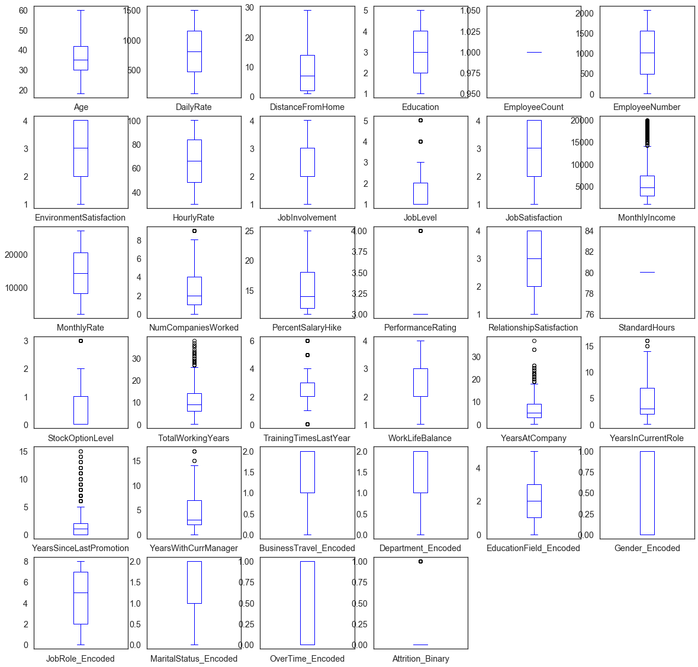


### Correlation Matrix With Categorical Data


```python
encoded_data_features = data[['Attrition_Binary','BusinessTravel_Encoded','Department_Encoded','EducationField_Encoded','Gender_Encoded','JobRole_Encoded','MaritalStatus_Encoded','OverTime_Encoded']]

f,ax = plt.subplots(figsize=(10,10))
sns.heatmap(encoded_data_features.corr(),annot=True, linewidths=5, ax=ax)
plt.show()
```


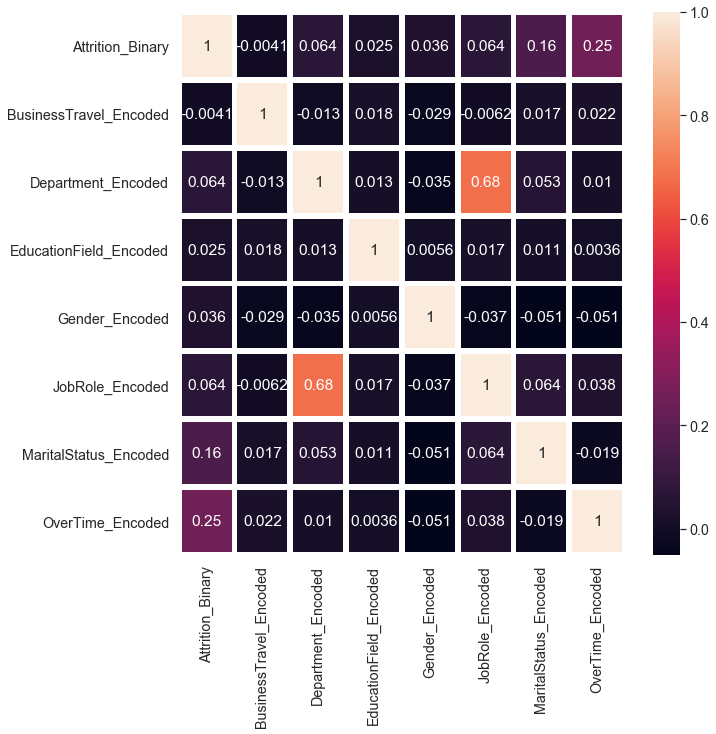


##### According to correlation matrix above, there is meaningful relationship between attrition and over time.


### Correlation Matrix With Numerical Data


```python
numerical_data_features = data[['Attrition_Binary','Age','DistanceFromHome','JobLevel','JobSatisfaction','MonthlyIncome','PercentSalaryHike','TotalWorkingYears','YearsAtCompany','YearsSinceLastPromotion']]

f,ax = plt.subplots(figsize=(10,10))
sns.heatmap(numerical_data_features.corr(),annot=True, linewidths=5, ax=ax)
plt.show()
```


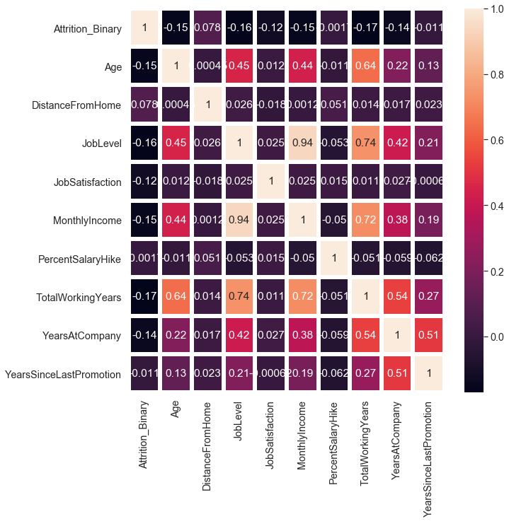


##### According to correlation matrix above, income, age and job level negatively correlated with attrition.

#### As a result of data analysis above, I decided to move on with " Over Time, Monthly Income, Total Working Years " features in my dataset.

## Clustering Algorithms
### 1) Centroid Based
        Cluster represented by central reference vector which may not be a part of the original data e.g k-means clustering
        
        * K-means Clustering
### 2) Hierarchical 
        Connectivity based clustering based on the core idea that points are connected to points close by rather than 
        further away. A cluster can be defined largely by the maximum distance needed to connect different parts of the
        cluster. Algorithms do not partition the dataset but instead construct a tree of points which are typically 
        merged together.
        
        * Agglomerative Clustering
        * BIRCH Clustering
### 3) Distribution Based
        Built on statistical distribution models - objects of a cluster are the ones which belong likely to same 
        distribution. Tend to be complex clustering models which might be prone to overfitting on data points
        
        * Gausssian mixture models
### 4) Density Based
        Create clusters from areas which have a higher density of data points. Objects in sparse areas, which seperate 
        clusters, are considered noise and border points.
        
        * DBSCAN Clustering
        * Mean-shift Clustering


```python
from sklearn.cluster import KMeans
from sklearn.cluster import AgglomerativeClustering
from sklearn.cluster import DBSCAN
from sklearn.cluster import MeanShift
from sklearn.cluster import Birch
from sklearn.cluster import AffinityPropagation
from sklearn.cluster import MiniBatchKMeans
```


```python
IBM_data = data[['Attrition_Binary','OverTime_Encoded','MonthlyIncome','TotalWorkingYears']]

IBM_data.head()
```


<div>
<style scoped>
    .dataframe tbody tr th:only-of-type {
        vertical-align: middle;
    }

    .dataframe tbody tr th {
        vertical-align: top;
    }

    .dataframe thead th {
        text-align: right;
    }
</style>
<table border="1" class="dataframe">
  <thead>
    <tr style="text-align: right;">
      <th></th>
      <th>Attrition_Binary</th>
      <th>OverTime_Encoded</th>
      <th>MonthlyIncome</th>
      <th>TotalWorkingYears</th>
    </tr>
  </thead>
  <tbody>
    <tr>
      <th>0</th>
      <td>1.0</td>
      <td>1.0</td>
      <td>5993</td>
      <td>8</td>
    </tr>
    <tr>
      <th>1</th>
      <td>0.0</td>
      <td>0.0</td>
      <td>5130</td>
      <td>10</td>
    </tr>
    <tr>
      <th>2</th>
      <td>1.0</td>
      <td>1.0</td>
      <td>2090</td>
      <td>7</td>
    </tr>
    <tr>
      <th>3</th>
      <td>0.0</td>
      <td>1.0</td>
      <td>2909</td>
      <td>8</td>
    </tr>
    <tr>
      <th>4</th>
      <td>0.0</td>
      <td>0.0</td>
      <td>3468</td>
      <td>6</td>
    </tr>
  </tbody>
</table>
</div>


```python
IBM_data.shape
```


    (1394, 4)


```python
IBM_data = IBM_data.sample(frac=1).reset_index(drop=True)
IBM_data.head()
IBM_data.info()
```

    <class 'pandas.core.frame.DataFrame'>
    RangeIndex: 1394 entries, 0 to 1393
    Data columns (total 4 columns):
    Attrition_Binary     1394 non-null float64
    OverTime_Encoded     1394 non-null float64
    MonthlyIncome        1394 non-null int64
    TotalWorkingYears    1394 non-null int64
    dtypes: float64(2), int64(2)
    memory usage: 43.6 KB
    


```python
IBM_data_features = IBM_data.drop('Attrition_Binary', axis=1)
IBM_data_features.head()
```


<div>
<style scoped>
    .dataframe tbody tr th:only-of-type {
        vertical-align: middle;
    }

    .dataframe tbody tr th {
        vertical-align: top;
    }

    .dataframe thead th {
        text-align: right;
    }
</style>
<table border="1" class="dataframe">
  <thead>
    <tr style="text-align: right;">
      <th></th>
      <th>OverTime_Encoded</th>
      <th>MonthlyIncome</th>
      <th>TotalWorkingYears</th>
    </tr>
  </thead>
  <tbody>
    <tr>
      <th>0</th>
      <td>0.0</td>
      <td>2013</td>
      <td>15</td>
    </tr>
    <tr>
      <th>1</th>
      <td>0.0</td>
      <td>2439</td>
      <td>4</td>
    </tr>
    <tr>
      <th>2</th>
      <td>1.0</td>
      <td>6162</td>
      <td>9</td>
    </tr>
    <tr>
      <th>3</th>
      <td>0.0</td>
      <td>2728</td>
      <td>2</td>
    </tr>
    <tr>
      <th>4</th>
      <td>1.0</td>
      <td>6796</td>
      <td>18</td>
    </tr>
  </tbody>
</table>
</div>


```python
IBM_data_attrition = IBM_data['Attrition_Binary']
IBM_data_attrition.sample(10)
```


    964     0.0
    215     0.0
    774     0.0
    405     0.0
    861     0.0
    1341    1.0
    887     1.0
    406     0.0
    707     0.0
    1303    0.0
    Name: Attrition_Binary, dtype: float64


### Evaluation Metrics
##### Homogeneity Score
    Clustering satisfies homogeneity if all of its clusters contains only points which are members of a single class.
    The actual label values do not matter i.e the fact that actual label 1 corresponds to cluster label 2 does
    not affect this score
##### Completeness Score
    Clustering satisfies completeness if all the points that are members of the same class belong to the same cluster
##### V Measure Score
    Harmonic mean of homogeneity and completeness score - usually used to find the avarage of rates
##### Adjusted Rand Score
    Similarity measure between clusters which is adjusted for chance i.e random labeling of data points
    Close to 0: data was randomly labeled
    Exact 1: actual and predicted clusters are identical 
##### Adjusted Mutual Information Score
    Information obtained about one random variable by observing another random variable adjusted to account for chance
    Close to 0: data was randomly labeled
    Exact 1: actual and predicted clusters are identical
##### Silhouette Score
    Uses a distance metric to measure how similar a point is to its own cluster and how dissimilar the point is from
    points in other clusters. Ranges between -1 and 1 and positive values closer to 1 indicate that the clustering
    was good


```python
def BuildModel(clustering_model,data,labels):
    model=clustering_model(data)
    print('homo\tcompl\tv-means\tARI\tAMI\tsilhouette')
    print(50*'_')
    print('%.3f\t%.3f\t%.3f\t%.3f\t%.3f\t%.3f'
         %(metrics.homogeneity_score(labels, model.labels_),
           metrics.completeness_score(labels, model.labels_),
           metrics.v_measure_score(labels, model.labels_),
           metrics.adjusted_rand_score(labels, model.labels_),
           metrics.adjusted_mutual_info_score(labels, model.labels_),
           metrics.silhouette_score(data,model.labels_)))
```

#### K-Means Clustering
    To process the learning data, the K-means algorithm in data mining starts with a first group of randomly
    selected centroids, which are used as the beginning points for every cluster, and then performs iterative (repetitive) 
    calculations to optimize the positions of the centroids.It halts creating and optimizing clusters when either:
    The centroids have stabilized — there is no change in their values because the clustering has been successful.
    The defined number of iterations has been achieved.
    
    
### Contrasting K-Means and Hierarchical Clustering
##### K-Means
    * Need distance measure as well as way to aggregate points in a cluster
    * Must represent data as vectors in N-dimensional hyperspace
    * Data representation can be difficult for complex data types
    * Variants can efficiently deal with very large datasets on disk
##### Hierarchical
    * Only need distance measure; do not need way to combine points in cluster
    * No need to express data as vectors in N-dimensional hyperspace
    * Relatively simple to represent even complex documents
    * Even with careful construction too computationaly expensive for large datasets on disk


```python
def k_means(data,n_clusters=2, max_iter=1000):
    model = KMeans(n_clusters=n_clusters, max_iter=max_iter).fit(data)
    
    return model
```


```python
BuildModel(k_means,IBM_data_features,IBM_data_attrition)
```

    homo	compl	v-means	ARI	AMI	silhouette
    __________________________________________________
    0.006	0.006	0.006	-0.038	0.005	0.698
    

#### According to scores our k-means cluster perform did not well. Let's try other algorithms and hope an accuracy improvement


```python

```
